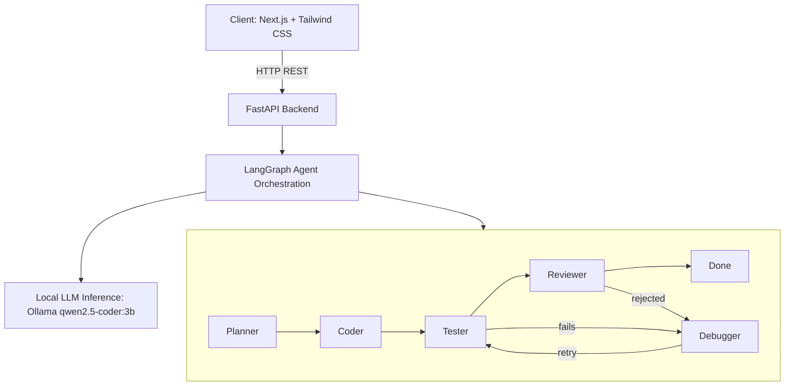

# Multi-Agent Backend Generator

> A multi-agent AI system that generates complete backend projects from plain-English descriptions. Five orchestrated agents plan, write, test, review, and automatically repair code, producing working FastAPI or Express projects — running entirely on local infrastructure with no paid API dependency.


---

## Overview

Multi-Agent Backend Generator is a full-stack application that turns a natural-language description, such as "a todo app with CRUD endpoints" or "a backend with JWT authentication," into a complete, working, multi-file backend project. A FastAPI backend orchestrates five specialized agents using LangGraph, with all language model inference running locally through Ollama rather than a paid cloud API. A Next.js frontend provides a live view of the agent pipeline, generated source code, and a downloadable project archive.

The system is self-correcting: generated code is executed and reviewed automatically, and any failures are routed back through a repair agent before the result is returned to the user.

---

## Features

- Generates multi-file backend projects with correct folder structure, not single isolated snippets
- Supports two output frameworks: FastAPI (Python) and Express (Node.js)
- Executes generated code in an isolated temporary directory to verify it imports and runs without error
- Automatically detects and corrects common failure patterns — relative import errors, missing FastAPI imports, and package-name-to-import-name mismatches — through both prompt constraints and deterministic post-processing
- Self-correcting loop: failed code is automatically sent to a Debugger agent and re-tested, up to a configured iteration limit
- Delivers the completed project as a downloadable ZIP archive
- Web interface showing live per-agent status, total generation time, debugger iteration count, and syntax-highlighted per-file source code

---

## Architecture



---

## Tech Stack

| Layer | Technology | Purpose |
|---|---|---|
| Frontend | Next.js, Tailwind CSS | User interface, live agent status, code viewer |
| Backend | FastAPI, Python | REST API, request handling |
| Orchestration | LangGraph, LangChain | Multi-agent state graph, conditional routing |
| LLM Inference | Ollama (qwen2.5-coder:3b) | Local, offline code generation |
| Code Highlighting | React Syntax Highlighter | Displaying generated source code |

---

## Project Structure

```
multi-agent-dev/
├── backend/
│   ├── main.py                # FastAPI app, graph wiring, /generate and /download endpoints
│   ├── llm.py                  # Ollama connection
│   ├── graph.py                 # Shared agent state definition
│   ├── zip_utils.py              # Packages generated files into a downloadable ZIP
│   ├── agents/
│   │   ├── planner.py            # Breaks the request into a file plan
│   │   ├── coder.py               # Generates source code for each file
│   │   ├── tester.py               # Executes/imports generated code to verify correctness
│   │   ├── reviewer.py              # Reviews code quality and approves or rejects
│   │   └── debugger.py               # Repairs failing code and loops back to the Tester
│   ├── requirements.txt
│   └── .gitignore
│
└── frontend/
    ├── app/
    │   └── page.js                # Main UI — task form, agent status, code viewer
    ├── package.json
    └── .gitignore
```

---

## Local Development

### Prerequisites

- Python 3.11 or higher
- Node.js and npm
- Ollama installed locally, with a code-capable model pulled

```bash
ollama pull qwen2.5-coder:3b
```

### 1. Clone the repository

```bash
git clone https://github.com/Rishav45-developer/Multi_agent-dev.git
cd Multi_agent-dev
```

### 2. Backend setup

```bash
cd backend
python -m venv venv
venv\Scripts\activate
pip install -r requirements.txt
uvicorn main:app --reload
```

API runs at `http://127.0.0.1:8000`
Interactive API docs at `http://127.0.0.1:8000/docs`

### 3. Frontend setup

```bash
cd frontend
npm install
npm run dev
```

Application runs at `http://localhost:3000`

---

## API Reference

### `POST /generate`

Runs the full agent pipeline and returns the generated project.

**Request body:**
```json
{
  "task": "a todo app with create, read, update, delete endpoints",
  "framework": "fastapi"
}
```

**Response:**
```json
{
  "task": "a todo app with create, read, update, delete endpoints",
  "framework": "fastapi",
  "plan": [ ... ],
  "files": { "main.py": "...", "models.py": "..." },
  "test_result": "All files checked successfully.",
  "passed": true,
  "review": "APPROVED",
  "approved": true,
  "iteration": 0,
  "task_id": "generated-uuid"
}
```

### `GET /download/{task_id}`

Returns a ZIP archive of the files generated for a given `task_id`.

---

## Known Limitations

- The Tester currently performs syntax and import verification only. It does not start the generated server or exercise its endpoints, so logic errors that do not surface as import or syntax failures can pass undetected.
- The local 3B-parameter model occasionally introduces cross-file inconsistencies on complex, multi-concern tasks — for example, referencing a function in one file that was never actually defined in the file it was imported from. This is most noticeable when combining multiple concerns, such as authentication and database integration, in a single request.
- Generated results are stored in memory only and are cleared when the backend server restarts.
- Testing generated Node.js projects assumes required packages are available in the global npm environment rather than installed per project.

---

## Project Motivation

This project was built as a learning exercise in multi-agent system design, orchestration with LangGraph, and the practical constraints of running LLMs locally on consumer hardware, as an alternative to relying on paid cloud inference APIs during development and iteration.

---

## License

MIT License — open for use, modification, and distribution.

---

## Author

Developed by Rishav